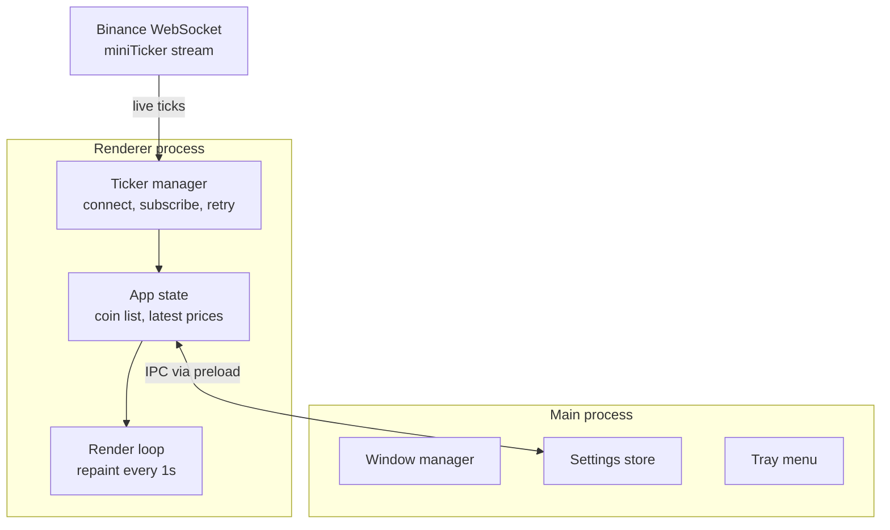

# Crypto Widget

A minimal, resizable desktop widget that shows live cryptocurrency prices and 24h change. Pick any coins you like, drag it wherever you want, and let it sit quietly on your screen.

[Crypto Widget](docs/screenshot.png)

## Features

- **Live prices over WebSocket.** Prices are pushed from Binance's public market stream, so there is no polling and no API key.
- **Price and 24h change** per coin, colour-coded green and red, with a brief flash on every price move.
- **Add as many coins as you like.** Search by ticker (`SOL`) or common name (`solana`), press Enter to add, right-click a row to remove it.
- **Frameless and resizable.** Drag the header to move it, drag the edges to resize. Layout scales cleanly from a couple of coins to a full column.
- **Remembers everything.** Coin list, window size, and position are saved and restored on launch.
- **Tray menu.** Show or hide the widget, toggle always-on-top, toggle launch on startup, or quit.
- **Zoom with `Ctrl +` / `Ctrl -`** (`Ctrl 0` resets).
- **Smart price formatting.** Decimals adapt to the price so tiny coins stay readable:

  | Price | Decimals |
  |---|---|
  | above 1000 | 2 |
  | 1 to 1000 | 3 |
  | below 1 | 4 to 8 |

- **Resilient connection.** Automatic reconnect with exponential backoff, and rows dim if no tick arrives for 10 seconds so you never mistake a stale price for a live one.
- **Lightweight.** A single shared WebSocket for all coins and a throttled, in-place UI update keep CPU use near zero.

## Tech stack

| Layer | Choice |
|---|---|
| Shell | Electron |
| UI | Vanilla JavaScript, HTML, CSS |
| Data | Binance public WebSocket (`@miniTicker`) |
| Persistence | `electron-store` (v8) |
| IPC | `contextBridge` + preload script |
| Packaging | `electron-builder` (NSIS installer) |

## Architecture



**Data flow:** ticks arrive over one persistent WebSocket, overwrite the latest price for that symbol in memory, and mark it as changed. A 1s timer repaints only the changed rows by updating text nodes in place, so ticks and rendering are decoupled and nothing is rebuilt.

**Process split:** the renderer owns the data and UI. The main process owns everything OS-level (window, tray, startup, persistence). The only things crossing the boundary are settings and tray actions, exposed through a small allowlisted preload API.

## Getting started

### Prerequisites

- [Node.js](https://nodejs.org/) 18 or newer
- npm

### Run in development

```bash
git clone https://github.com/areebarifshaikh/crypto-widget
cd crypto-widget
npm install
npm start
```

### Build an installer (Windows)

```bash
npm run dist
```

The installer is written to `dist/` as `Crypto Widget Setup <version>.exe`. Packaging requires an icon of at least 256x256 pixels at `assets/icon.png`.

> **Note:** the installer is unsigned, so Windows SmartScreen will show a warning on first run. Choose **More info**, then **Run anyway**.

## Usage

| Action | How |
|---|---|
| Add a coin | Click `+`, type a ticker or name, press Enter or click a result |
| Remove a coin | Right-click its row |
| Move | Drag the header |
| Resize | Drag the window edges |
| Zoom text | `Ctrl +`, `Ctrl -`, `Ctrl 0` |
| Show or hide | Left-click the tray icon |
| Always on top, launch on startup, quit | Right-click the tray icon |

Launch on startup is only available in the packaged build.

## Project structure

```
crypto-widget/
├── electron/
│   ├── main.js        # window, tray, persistence, IPC handlers
│   └── preload.js     # safe bridge between renderer and main
├── src/
│   ├── index.html
│   ├── main.js        # UI logic, coin search, add/remove
│   ├── ticker.js      # WebSocket manager (subscribe, reconnect)
│   ├── render.js      # throttled in-place rendering and price formatting
│   └── style.css
├── assets/
│   └── icon.png
└── package.json
```

## Notes

- Data comes from Binance's public market data stream. If Binance is blocked on your network, the alternative market-data endpoint `data-stream.binance.vision` can be used in `ticker.js`.
- `electron-store` is pinned to v8 because later versions are ESM-only and this project uses CommonJS in the main process.
- Prices are quoted in USDT.
- This project is not affiliated with Binance. It is for informational use only and is not financial advice.

## Roadmap

- [ ] Persist zoom level between launches
- [ ] Price alerts with native notifications
- [ ] Compact mode for narrow widths
- [ ] Drag-to-reorder coins
- [ ] Local currency conversion (for example PKR)

## License

MIT
